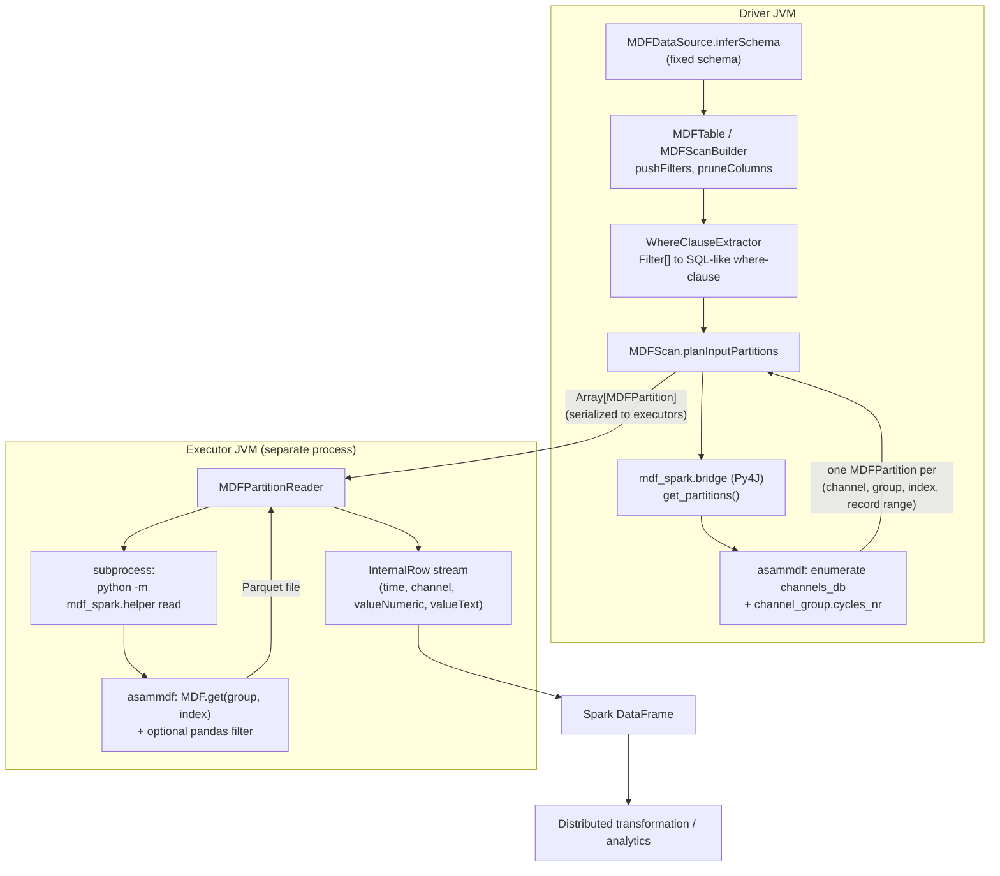
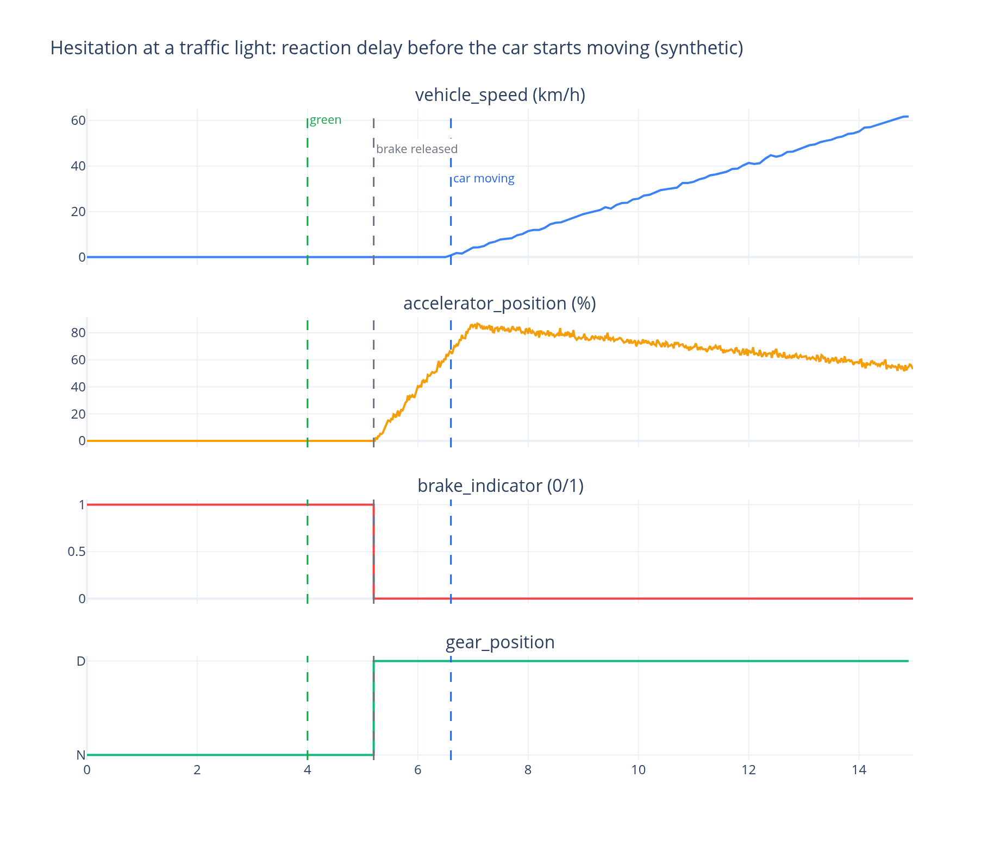

# spark-asammdf

A read-only Apache Spark DataSource V2 connector that reads [ASAM MDF4](https://www.asam.net/standards/detail/mdf/)
automotive measurement files into Spark DataFrames, registered as
`com.datenwissenschaften.MDFDataSource`.

## The problem

ASAM MDF/MF4 measurement files are the standard binary container used across the automotive
industry to log measurement-bus data — ECU signals, sensor channels, bus traces — during vehicle
testing and development. A single file typically holds many channels sampled at different rates,
organized into channel groups. MDF4 is binary and not splittable the way Spark's native formats
are, so getting it in front of Spark's distributed filtering and aggregation usually means an
ad-hoc conversion step. `spark-asammdf` removes that step: point `spark.read` at an `.mf4` file
and get a Spark DataFrame back, with filter pushdown into the underlying file.

## Overview

MDF4 parsing is **not implemented natively** in this project. It is delegated entirely to the
mature Python [`asammdf`](https://github.com/danielhrisca/asammdf) library. What this repository
adds is the Spark-side integration: a DataSource V2 implementation in Scala, a Py4J bridge for
driver-side query planning, and a per-partition Python subprocess for executor-side reads. This
hybrid design exists for a concrete reason, not as an architectural preference: **in a real
(non-local) Spark cluster, executors run in separate JVM processes from the driver and cannot
call back into the driver's Py4J bridge object**. So query planning (which channels exist, how
many samples each has) happens once on the driver via Py4J, while actually reading sample values
happens independently on each executor by invoking `python -m mdf_spark.helper` as a fresh
subprocess. This has been verified by running the connector against a real local Spark standalone
cluster with separate master/worker JVMs (not just `local[*]`); that verification is manual today,
not part of automated CI — see [Compatibility](#compatibility).

## Architecture



By default, parallelism happens **across channels and channel occurrences**: each `(channel,
group, index)` occurrence resolved during planning becomes exactly one Spark partition, read
independently. Setting the `maxRecordsPerPartition` read option additionally splits **within** a
single large channel occurrence, by record range:

```python
df = (
    spark.read
    .format("com.datenwissenschaften.MDFDataSource")
    .option("path", "large_measurement.mf4")
    .option("maxRecordsPerPartition", "500000")
    .load()
)
```

A channel occurrence with more than 500,000 records is then planned as multiple `[offset, offset +
count)` record-range partitions instead of one — each read independently via `asammdf`'s
`record_offset`/`record_count` support in `MDF.get()`, which decodes only that range rather than
the whole channel (verified in `test_helper.py::test_read_data_with_record_range_matches_full_read_slice`
to return byte-identical rows to an unchunked read, and in
`test_mdf_datasource.py::test_max_records_per_partition_splits_a_large_channel` to actually produce
multiple Spark partitions end-to-end). Without the option (the default), behavior is unchanged
from a whole-occurrence-per-partition read.

Separation of concerns in the source tree:

| Concern | Location |
|---|---|
| DSv2 entry point / schema | `MDFDataSource.scala` |
| Table / capabilities | `MDFTable.scala` |
| Filter pushdown & column pruning | `MDFScanBuilder.scala`, `WhereClauseExtractor.scala` |
| Partition planning | `MDFScan.scala` |
| Partition reading (executor) | `MDFPartitionReader.scala`, `MDFPartitionReaderFactory.scala` |
| Driver↔Python contract | `MDFPythonBridge.scala` (Scala side), `mdf_spark/bridge.py` (Python side) |
| MDF parsing + Parquet handoff | `mdf_spark/helper.py` (Python, via `asammdf`) |

## Supported MDF functionality

Only what is actually exercised by this connector and its test suite:

- **Channels and channel groups**: enumerated via `asammdf`'s `channels_db` / `groups` metadata;
  each channel occurrence (a channel can appear in more than one group, e.g. logged on multiple
  buses) becomes its own partition and is concatenated with same-named occurrences when read
  without an explicit occurrence hint.
- **Timestamps**: relative per-channel timestamps are converted to absolute microsecond-precision
  timestamps using the file's `header.start_time`.
- **Physical values**: `asammdf`'s `MDF.get()` applies its own channel conversions by default, so
  numeric samples arrive as physical (converted) values, not raw. This connector does not
  implement conversion logic itself.
- **Numeric and string sample types**: numeric samples populate `valueNumeric` (double); any other
  dtype is converted to its string representation and populated into `valueText`, with
  `valueNumeric` left genuinely `NULL` for those rows (and vice versa) — exercised end-to-end by
  the fixture's `traffic_light_state`/`gear_position` string channels, not just numeric ones.
- **Cycle counts**: read directly from `channel_group.cycles_nr` metadata, so counting rows never
  requires decoding sample arrays.

**Explicit limitations** — not claimed, not tested:

- No MDF3 support is tested; the fixture and test suite only exercise MDF4.
- Channel **units** and other channel metadata are visible when inspecting a file directly through
  `asammdf` (as the example notebook does), but are **not propagated into the Spark schema or
  DataFrame** — `valueNumeric`/`valueText` carry no unit information.
- No support for structured/array channels, CAN-specific decoding (DBC), or bus-timing metadata.
- No write path: this is a read-only source (`TableCapability.BATCH_READ` only).

## Spark integration

- **Filter pushdown**: `MDFScanBuilder` implements `SupportsPushDownFilters`; pushed filters are
  rendered to a SQL-like where-clause by `WhereClauseExtractor`, which translates `EqualTo`,
  `GreaterThan(OrEqual)`, `LessThan(OrEqual)`, `In`, `IsNull`/`IsNotNull`, `And`/`Or`/`Not`, and the
  three `StringStartsWith`/`EndsWith`/`Contains` variants. Anything else degrades to an always-true
  fallback. Pushed filters are **not** marked as fully handled, so Spark re-applies the original
  filter after reading regardless — pushdown here is a pure I/O optimization (skip channels/rows
  early), never a correctness requirement.
- **Column pruning**: `SupportsPushDownRequiredColumns` is implemented; requesting only the
  `channel` column lets `MDFPartitionReader` synthesize rows from the already-known cycle count
  without invoking Python at all for that partition.
- **No unnecessary driver-side collection**: the driver only ever calls the Python bridge once per
  scan, to plan partitions (channel/group/index/count metadata) — never to read sample values.
- **No mutable shared state across the driver/executor boundary**: `MDFPartitionReader` never
  touches `MDFDataSource`'s bridge singleton; it re-invokes `asammdf` from scratch via subprocess,
  which is what makes it correct on a real multi-JVM cluster (see [Overview](#overview)).
- **Logging**: uses SLF4J (`MDFScan`) rather than `println`, consistent with idiomatic Spark
  connector code.

## Schema / data representation

```
root
 |-- time: timestamp
 |-- channel: string
 |-- valueNumeric: double
 |-- valueText: string
```

The schema is fixed and **"long"/tall** — one row per `(time, channel)` sample — rather than one
column per channel. Exactly one of `valueNumeric`/`valueText` is populated per row, depending on
whether the channel's samples are numeric. This representation was kept as-is: it stays stable
across MDF files with arbitrary, differing channel sets (no per-file schema inference surprises),
at the cost of requiring an explicit `groupBy(...).pivot(...)` when wide, per-channel analysis is
needed — demonstrated in the [example notebook](notebooks/spark_asammdf_workflow.ipynb).

## Quick start

```bash
sbt package                                    # builds target/scala-2.13/spark-asammdf-scala_2.13-0.1.jar
pip install -e .                               # installs the mdf_spark Python package
python src/test/resources/generate_fixture.py  # writes the synthetic fixture used below
```

```python
import os
import sys
from pyspark.sql import SparkSession

os.environ["PYSPARK_PYTHON"] = sys.executable
os.environ["PYTHONPATH"] = "src/main/python"

spark = (
    SparkSession.builder
    .master("local[*]")
    # Binds explicitly to loopback so this also works in sandboxed/CI
    # environments where binding to the detected host address is not permitted.
    .config("spark.driver.bindAddress", "127.0.0.1")
    .config("spark.driver.host", "127.0.0.1")
    .config("spark.jars", "target/scala-2.13/spark-asammdf-scala_2.13-0.1.jar")
    .config("spark.executorEnv.PYTHONPATH", "src/main/python")
    .getOrCreate()
)

from mdf_spark import init_bridge
init_bridge(spark)  # must run once per driver JVM before any read

df = (
    spark.read
    .format("com.datenwissenschaften.MDFDataSource")
    .option("path", "src/test/resources/data/sample.mf4")
    .load()
)

df.where("channel = 'vehicle_speed'").where("valueNumeric > 50").show(10, False)
```

This is the same call sequence exercised by `src/test/python/test_mdf_datasource.py`.

## Running on Databricks

> **Not exercised by this repository's CI or test suite.** The steps below follow from the
> connector's architecture (see [Overview](#overview)) and Databricks' own documented deployment
> mechanisms, but — unlike everything in [Compatibility](#compatibility) — have not been verified
> against a real Databricks workspace. Treat this as deployment guidance, not a tested claim.

Databricks clusters are a real (non-local) Spark cluster, in the same sense the
[Overview](#overview) section means it: executors run as separate processes from the driver. That
is exactly the case this connector's driver/executor split (Py4J bridge for planning,
per-partition Python subprocess for reading) was built and manually verified for, so the
architecture should carry over directly. What's specific to Databricks is *how the jar and the
`mdf_spark` Python package get onto every node* — a notebook's `spark` session doesn't let you set
`spark.jars` or `spark.executorEnv.PYTHONPATH` after the fact the way the [Quick start](#quick-start)
snippet does, so both have to be installed as **cluster-scoped libraries** before the cluster (or a
restart of it) picks them up:

1. Build both artifacts locally, the same way the [Quick start](#quick-start) and
   [Development](#development) sections do:
   ```bash
   sbt package     # target/scala-2.13/spark-asammdf-scala_2.13-0.1.jar
   sbt buildPython # dist/mdf_spark-1.0.0-*.whl (Cython-compiled, deps from setup.py's install_requires)
   ```
2. Upload the jar and the wheel to a Unity Catalog Volume (or DBFS) — e.g.
   `/Volumes/<catalog>/<schema>/<volume>/spark-asammdf/`.
3. In the cluster's **Libraries** tab, install both as cluster-scoped libraries from that Volume
   path (one JAR library, one Python wheel library), then restart the cluster. This is what makes
   `mdf_spark`/`asammdf` importable by *every* executor's Python interpreter — not just the
   driver's — which is what a notebook-scoped `%pip install` does not reliably guarantee.
   Installing `asammdf`, `pyarrow`, `pandas`, and `numpy` individually as PyPI cluster libraries
   works too if you'd rather skip building the wheel.
4. Upload the `.mf4` file(s) to the same Volume. Read them via the Volume's local FUSE mount path
   (`/Volumes/<catalog>/<schema>/<volume>/spark-asammdf/sample.mf4`, or `/dbfs/...` for DBFS), not
   the `dbfs:/...` URI form — `asammdf` and the Python subprocess read the file as an ordinary
   local file, not through Spark's distributed filesystem abstraction.
5. In a notebook cell on that cluster:
   ```python
   from mdf_spark import init_bridge
   init_bridge(spark)  # `spark` is already provided by the Databricks notebook runtime

   df = (
       spark.read
       .format("com.datenwissenschaften.MDFDataSource")
       .option("path", "/Volumes/<catalog>/<schema>/<volume>/spark-asammdf/sample.mf4")
       .load()
   )
   df.where("channel = 'vehicle_speed'").show()
   ```
   No `spark.jars` or `spark.executorEnv.PYTHONPATH` config is needed here — both are already on
   every node via the cluster libraries installed in step 3.

Two things worth flagging explicitly rather than discovering at runtime:
- This needs a classic all-purpose or job cluster where executors are permitted to spawn
  subprocesses (`MDFPartitionReader` shells out to `python -m mdf_spark.helper` per partition).
  Whether Databricks Serverless compute permits this has not been checked.
- The executor-side Python interpreter that matters is whatever Databricks' own `PYSPARK_PYTHON`
  already points to on that cluster; cluster-scoped library installs target that interpreter,
  which is why they're the reliable option here over a notebook-scoped `%pip install`.

## Synthetic example

The public repository contains no real vehicle, ECU, or customer data. The only data file
committed to the repository, `src/test/resources/data/sample.mf4`, is generated deterministically
by `src/test/resources/generate_fixture.py`: eight generic, seeded synthetic channels
(`engine_speed`, `vehicle_speed`, `accelerator_position`, `brake_pressure`, `battery_voltage`,
`traffic_light_state`, `brake_indicator`, `gear_position`) encoding a short synthetic scenario —
stopped at a red light, a driver reaction delay after it turns green, then accelerate → cruise →
brake → idle. `traffic_light_state` and `gear_position` are string-valued (populating
`valueText`); the rest are numeric (`valueNumeric`). Regenerate it at any time with
`python src/test/resources/generate_fixture.py` or `make fixture`.

**[`notebooks/spark_asammdf_workflow.ipynb`](notebooks/spark_asammdf_workflow.ipynb)** is the
end-to-end, human-facing demonstration: it loads that fixture through the real connector (not a
reimplementation), explores the schema, and runs several distributed Spark aggregations before
visualizing the small, aggregated results with Plotly — including reconstructing, purely from
Spark queries against the connector's output, the causal timeline between the traffic light
turning green and the car actually starting to move. Regenerate the notebook and its chart assets
with `make example` (see [Development](#development)).



## Testing

23 tests, all deterministic, none requiring network access, credentials, or proprietary data:

- **4 Scala unit tests** (`WhereClauseExtractorTest`, ScalaTest): filter-to-where-clause
  translation for empty, single, `In`, and combined filters.
- **13 Python unit tests** (`test_helper.py`): partition enumeration, where-clause-scoped
  enumeration, `lru_cache` memoization of `get_partitions` (asserted via a mock call count, since
  Spark re-invokes planning on every action and can invoke it more than once under AQE), full
  channel reads, reads via an explicit `(group, index)` occurrence hint, value-filtered reads,
  `maxRecordsPerPartition` record-range chunking (`_record_chunks`'s split points, `get_partitions`
  producing multiple chunk partitions for a large occurrence, and a chunked read matching the
  corresponding slice of an unchunked read byte-for-byte), a string-valued channel read (`valueText`
  populated, `valueNumeric` left `NaN`), and a regression test asserting every channel's absolute
  timestamps land in a plausible year regardless of its own sample rate.
- **6 Python integration tests** (`test_mdf_datasource.py`): a real local `SparkSession` (bound to
  `127.0.0.1` for sandboxed/CI environments) loading the built jar and reading the synthetic
  fixture end-to-end through `com.datenwissenschaften.MDFDataSource` — an `IN` filter, a numeric
  value filter, `maxRecordsPerPartition` actually producing 3 Spark partitions (vs. 1 without it)
  with identical resulting rows, a string-channel read, the "exactly one of valueNumeric/valueText
  is non-null" schema invariant holding across every row in the file, and the hesitation scenario's
  full causal timeline (light green → brake released → gear engaged → pedal pressed → car moving)
  reconstructed purely from Spark queries and asserted to hold in that order.

Run everything with `make test`, or individually with `sbt test` and
`python -m pytest src/test/python -v`.

The example notebook is not executed in CI — installing Jupyter/Kaleido and running a full
notebook adds real fragility for comparatively little signal. Instead, `test_mdf_datasource.py`
(run in CI) exercises the exact same underlying read/filter/aggregate workflow the notebook
narrates, against the same jar and fixture. Regenerate the notebook itself locally with
`make example` after any change to the connector.

## Compatibility

Only the combination CI actually exercises is claimed as tested:

| Scala | Spark | Java | Python | Status |
|---|---|---|---|---|
| 2.13.12 | 4.0.0 | 21 (Temurin) | 3.12 | Tested in CI (`.github/workflows/ci.yml`) |

No other Scala/Spark/Java/Python combination is claimed to work. Multi-JVM standalone-cluster
execution (separate master/worker processes, not `local[*]`) has been manually verified but is not
currently part of automated CI.

## Limitations

Stated plainly, not buried:

- MDF parsing correctness is bounded by whatever `asammdf` supports; this project adds no
  independent parsing logic or spec-compliance testing of its own.
- Channel units and other MDF channel metadata are not surfaced in the resulting DataFrame.
- The schema is fixed and cannot currently be widened to one column per channel without an
  explicit pivot downstream.
- Intra-channel (record-range) splitting via `maxRecordsPerPartition` (see
  [Spark integration](#spark-integration)) is opt-in, not automatic: without it, one very large
  channel occurrence is still read as a single, non-parallelized partition, and even with it set,
  Spark's partition *count* changes but the connector does no auto-tuning to pick a good threshold
  for a given cluster/file.
- Filter pushdown only understands the filter kinds listed in
  [Spark integration](#spark-integration); everything else still returns correct results (Spark
  re-applies filters), just without the I/O savings.
- Every executor node needs `PYSPARK_PYTHON` pointed at a Python environment with `mdf_spark`
  and `asammdf` importable, and `spark.executorEnv.PYTHONPATH` set accordingly — there is no
  automatic environment packaging/shipping.
- Read-only: no write support, no streaming support, no catalog/table registration beyond ad-hoc
  `.format(...).option("path", ...)` reads.

## Development

```bash
python -m venv .venv && source .venv/bin/activate
pip install -e .
pip install -r notebooks/requirements.txt   # only needed to regenerate the example notebook
```

- `sbt scalafmtCheckAll` / `sbt scalafmtAll` — formatting gate (also enforced in CI).
- `sbt test` — Scala unit tests.
- `python -m pytest src/test/python -v` — Python unit + integration tests (needs the jar built
  and the fixture generated first; see [Quick start](#quick-start)).
- `sbt buildAll` (or just the `buildPython` part of it) — cleans, builds the Scala jar, and builds
  the Cython-compiled Python wheel (`setup.py`) used for distribution (e.g. for
  [Running on Databricks](#running-on-databricks)). This invokes `.venv/bin/python3 setup.py`
  directly rather than through `pip`, so — unlike `pip install -e .` — it needs `setuptools`,
  `wheel`, and `Cython` installed into `.venv` itself: `pip install setuptools wheel Cython`
  (a plain `python -m venv` on Python 3.12+ does not bundle `setuptools`/`wheel` by default).
- `make example` — regenerates the synthetic fixture, rebuilds the jar, and re-executes the
  example notebook in place (which also regenerates the PNGs under
  `docs/assets/spark-asammdf/`). This is the single command referenced throughout this README for
  reproducing the notebook and its chart assets.

Notebook/example tooling (Jupyter, Plotly, Kaleido) is intentionally kept in
`notebooks/requirements.txt`, separate from `setup.py`'s runtime dependencies — the connector
itself never needs them.

## License

[MIT](LICENSE)
